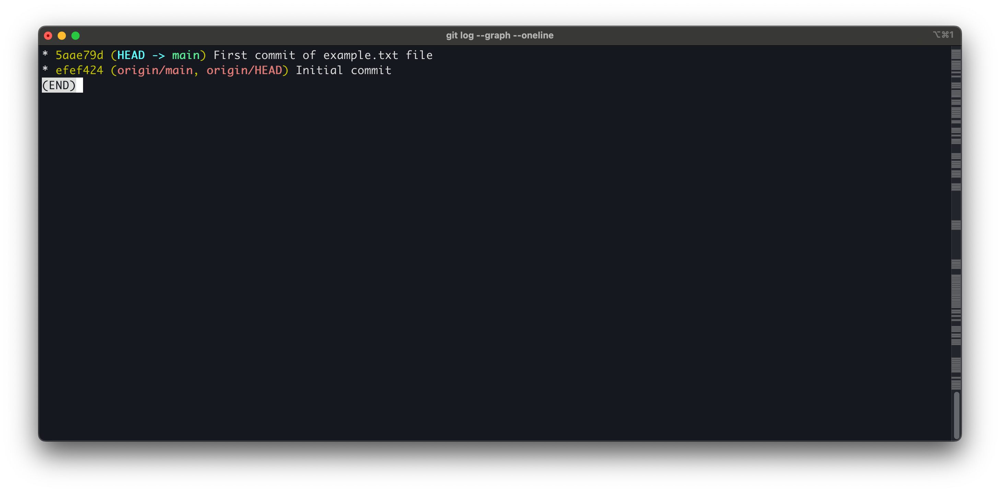

# MLOps-Jan2025

## GitHub Repository Link
[https://github.com/rkrmishra/MLOps-Jan2025](https://github.com/rkrmishra/MLOps-Jan2025.git)

## Assignment Steps
### Step 1: Create a new publick repository
- Open github site and create a new repository called - MLOpsJan2025
- Set the visibility to Public

### Step 2: Clone repository to on local FS
- Used following command
  ```
  git clone https://github.com/rkrmishra/MLOps-Jan2025.git
  ```

### Step 3: Create file and commit file `example.txt`
- Change directory to `MLOps-Jan2025` on local FS
  ```
  ~ cd MLOps-Jan2025
  ```
- Create the file using below command
  ```
  MLOps-Jan2025 git:(main) echo "This is the first cut of content" > example.txt
  ```
- Stage and commit
  ```
  MLOps-Jan2025 git:(main) git add example.txt
  MLOps-Jan2025 git:(main) git commit -m "First commit of example.txt file"
  ```
### Step 4: Create two branches G24AIT042-1 and G24AIT042+1 based on my roll no
  ```
  MLOps-Jan2025 git:(main) git branch G24AIT042-1
  MLOps-Jan2025 git:(main) git branch G24AIT042+1
  ```
### Step 5: Modify the file example.txt in each branch 
- Switch to branch `G24AIT042+1` using below command
  ```
  MLOps-Jan2025 git:(main) git checkout G24AIT042+1
  Switched to branch 'G24AIT042+1'
  MLOps-Jan2025 git:(G24AIT042+1)
  ```
- Modify file of branch `G24AIT042+1`
  ```
  MLOps-Jan2025 git:(G24AIT042+1) echo "Modified file being in branch G24AIT042+1" > example.txt
  ```
- Commit the changed file
  ```
  MLOps-Jan2025 git:(G24AIT042+1) ✗ git add example.txt
  MLOps-Jan2025 git:(G24AIT042+1) ✗ git commit -m "Updated the file of branch G24AIT042+1"
  [G24AIT042+1 1e2488b] Updated the file of branch G24AIT042+1
  1 file changed, 1 insertion(+), 1 deletion(-)
  MLOps-Jan2025 git:(G24AIT042+1)
  ```
- Switch to branch `G24AIT042-1` using below command
  ```
  MLOps-Jan2025 git:(G24AIT042+1) git checkout G24AIT042-1
  Switched to branch 'G24AIT042-1'
  MLOps-Jan2025 git:(G24AIT042-1)
  ```
- Modify file of branch `G24AIT042-1`
  ```
  MLOps-Jan2025 git:(G24AIT042-1) echo "Modified file being in branch G24AIT042-1" > example.txt
  ```
- Commit the changed file
  ```
  MLOps-Jan2025 git:(G24AIT042-1) ✗ git add example.txt
  MLOps-Jan2025 git:(G24AIT042-1) ✗ git commit -m "Updated the file of branch G24AIT042-1"
  [G24AIT042-1 7ba7249] Updated the file of branch G24AIT042-1
  1 file changed, 1 insertion(+), 1 deletion(-)
  MLOps-Jan2025 git:(G24AIT042-1)
  ```
### Step 6: Capture the log screenshot (before merge)
- Switch back to `main` branch
  ```
  MLOps-Jan2025 git:(G24AIT042-1) git checkout main
  Switched to branch 'main'
  Your branch is ahead of 'origin/main' by 1 commit.
  (use "git push" to publish your local commits)
  MLOps-Jan2025 git:(main)
  ```
- Here is the log output
  ```
  MLOps-Jan2025 git:(main) git log --graph --oneline
  * 5aae79d (HEAD -> main) First commit of example.txt file
  * efef424 (origin/main, origin/HEAD) Initial commit
  (END)
  ```
- Here is the screenshot
  
  

### Step 7: Merge the files from different branches
- Merge from `G24AIT042+1` to `main`
  ```
  MLOps-Jan2025 git:(main) git merge G24AIT042+1
  Updating 5aae79d..1e2488b
  Fast-forward
   example.txt | 2 +-
   1 file changed, 1 insertion(+), 1 deletion(-)
  MLOps-Jan2025 git:(main)
  ```
- Here is the screenshot
  
  
  
- Merge from `G24AIT042-1` to `main`
  ```
  MLOps-Jan2025 git:(main) git merge G24AIT042-1
  Auto-merging example.txt
  CONFLICT (content): Merge conflict in example.txt
  Automatic merge failed; fix conflicts and then commit the result.
  MLOps-Jan2025 git:(main) ✗
  ```
- We got the conflict. Now we need to resolve it. See the screenshot
- Merged the changes and resolved the conflict
  ```
  MLOps-Jan2025 git:(main) ✗ git commit -m "merged and resolved the conflict"
  [main 483c345] merged and resolved the conflict
  MLOps-Jan2025 git:(main) cat example.txt
  Modified file being in branch G24AIT042-1
  MLOps-Jan2025 git:(main)
  ```
### Step 8: Capture the git log screenshot (after merge)
- Here is the after the merge log
  ```
  MLOps-Jan2025 git:(main) git log --graph --oneline
  *   483c345 (HEAD -> main) merged and resolved the conflict
  |\
  | * 7ba7249 (G24AIT042-1) Updated the file of branch G24AIT042-1
  * | 1e2488b (G24AIT042+1) Updated the file of branch G24AIT042+1
  |/
  * 5aae79d First commit of example.txt file
  * efef424 (origin/main, origin/HEAD) Initial commit
  (END)
  ```
- Here is the screenshot
  
  

### Step 9: Push all the changes
- Let's push all the changes to the origin
  ```
  MLOps-Jan2025 git:(main) git push origin --all
  Username for 'https://github.com': rkmishra
  Password for 'https://rkmishra@github.com':
  remote: Support for password authentication was removed on August 13, 2021.
  remote: Please see https://docs.github.com/get-started/getting-started-with-git/about-remote-repositories#cloning-with-https-urls for information on currently
  recommended modes of authentication.
  fatal: Authentication failed for 'https://github.com/rkrmishra/MLOps-Jan2025.git/'
  MLOps-Jan2025 git:(main)
  ```
  As password support is terminated. So I need to generate token (classic) and use that to set origin.
  ```
  MLOps-Jan2025 git:(main) git remote set-url origin https://<tokem>@github.com/rkrmishra/MLOps-Jan2025
  MLOps-Jan2025 git:(main)
  ```
  Then I tried again to push
  ```
  MLOps-Jan2025 git:(main) git push origin --all
  Enumerating objects: 13, done.
  Counting objects: 100% (13/13), done.
  Delta compression using up to 4 threads
  Compressing objects: 100% (8/8), done.
  Writing objects: 100% (12/12), 1.17 KiB | 1.17 MiB/s, done.
  Total 12 (delta 1), reused 0 (delta 0), pack-reused 0
  remote: Resolving deltas: 100% (1/1), done.
  To https://github.com/rkrmishra/MLOps-Jan2025
   efef424..483c345  main -> main
   * [new branch]      G24AIT042+1 -> G24AIT042+1
   * [new branch]      G24AIT042-1 -> G24AIT042-1
  MLOps-Jan2025 git:(main)
  ```

### Step 10: Delete and Recover the branches 
- Delete both the branches
  ```
  MLOps-Jan2025 git:(main) git branch -d G24AIT042+1
  Deleted branch G24AIT042+1 (was 1e2488b).
  MLOps-Jan2025 git:(main) git branch -d G24AIT042-1
  Deleted branch G24AIT042-1 (was 7ba7249).
  MLOps-Jan2025 git:(main)
  ```
- Recover the branches
  ```
  MLOps-Jan2025 git:(main) git reflog
  MLOps-Jan2025 git:(main)
  MLOps-Jan2025 git:(main) git branch G24AIT042+1 483c345
  MLOps-Jan2025 git:(main)
  MLOps-Jan2025 git:(main) git branch
  MLOps-Jan2025 git:(main)
  MLOps-Jan2025 git:(main) git branch G24AIT042-1 483c345
  MLOps-Jan2025 git:(main)
  MLOps-Jan2025 git:(main) git checkout G24AIT042+1
  Switched to branch 'G24AIT042+1'
  MLOps-Jan2025 git:(G24AIT042+1) cat example.txt
  Modified file being in branch G24AIT042-1
  MLOps-Jan2025 git:(G24AIT042+1) git checkout G24AIT042-1
  Switched to branch 'G24AIT042-1'
  MLOps-Jan2025 git:(G24AIT042-1) cat example.txt
  Modified file being in branch G24AIT042-1
  MLOps-Jan2025 git:(G24AIT042-1)
  ```
### Step 11: Let's TAG the main branch 
- Tag the latest commit in the `main` branch as ver 1.0
  ```
  MLOps-Jan2025 git:(main) git tag -a ver1.0 -m "ver1.0"
  ```
- Push the tag to origin
  ```
  MLOps-Jan2025 git:(main) git push origin ver1.0
  Enumerating objects: 1, done.
  Counting objects: 100% (1/1), done.
  Writing objects: 100% (1/1), 163 bytes | 163.00 KiB/s, done.
  Total 1 (delta 0), reused 0 (delta 0), pack-reused 0
  To https://github.com/rkrmishra/MLOps-Jan2025
    * [new tag]         ver1.0 -> ver1.
  MLOps-Jan2025 git:(main)
  ```
- Screenshot for TAG
  
  
  

## Challenges faced
- Got merge conflict,
  - Resolved merge conflict 
- Origin was not set,
  - Set origin 
- Password did not work while pushing to Origin
  - Generated token (classic) from Github and used it in origin url
- Tag push to origin was not happening,
  - So used explicitly ver1.0 to push tag.
